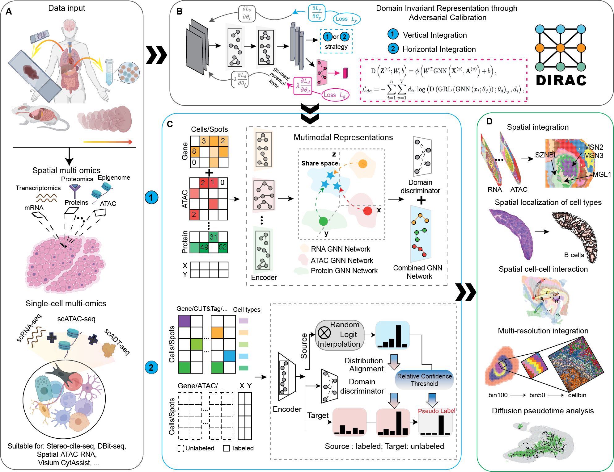

# DIRAC (Domain Invariant Respresentation through Adversatial Calibration)

[](https://github.com/boxiangliulab/DIRAC/stargazers)
[](https://pypi.org/project/sodirac)
[](https://anaconda.org/bioconda/scglue)
[](https://scglue.readthedocs.io/en/latest/?badge=latest)
[](https://github.com/gao-lab/GLUE/actions/workflows/build.yml)
[](https://github.com/gao-lab/GLUE/actions/workflows/build.yml)
[](https://opensource.org/licenses/MIT)


## Spatially resolved integration of multi-omics with DIRAC highlights cell-specific remodeling

Tangram is a Python package, written in [PyTorch](https://pytorch.org/) and based on [scanpy](https://scanpy.readthedocs.io/en/stable/), for mapping single-cell (or single-nucleus) gene expression data onto spatial gene expression data. The single-cell dataset and the spatial dataset should be collected from the same anatomical region/tissue type, ideally from a biological replicate, and need to share a set of genes. Tangram aligns the single-cell data in space by fitting gene expression on the shared genes. The best way to familiarize yourself with Tangram is to check out [our tutorial](https://github.com/broadinstitute/Tangram/blob/master/tutorial_tangram_with_squidpy.ipynb) and [our documentation](https://tangram-sc.readthedocs.io/en/latest/index.html). [](https://colab.research.google.com/drive/1jP3M7wu-YJrtDzvHSdK5HIdee0SNVs0b?usp=sharing)\
If you don't use squidpy yet, check out our [previous tutorial.](https://github.com/broadinstitute/Tangram/blob/master/tutorial_tangram_without_squidpy.ipynb)




For more details, please check out our [publication](https://doi.org/10.1038/s41587-022-01284-4).

## Directory structure

```
.
├── sodirac                  # Main Python package
├── data                    # Data files
├── evaluation              # Method evaluation pipelines
├── experiments             # Experiments and case studies
├── tests                   # Unit tests for the Python package
├── docs                    # Documentation files
├── custom                  # Customized third-party packages
├── packrat                 # Reproducible R environment via packrat
├── env.yaml                # Reproducible Python environment via conda
├── pyproject.toml          # Python package metadata
├── LICENSE
└── README.md
```

## Installation

The `DIRAC` package can be installed via conda using one of the following commands:

```sh
conda install -c conda-forge -c bioconda sodirac  
```

Or, it can also be installed via pip:

```sh
pip install sodirac
```

> Installing within a
> [conda environment](https://conda.io/projects/conda/en/latest/user-guide/tasks/manage-environments.html)
> is recommended.

## Usage

Please checkout the documentations and tutorials at
[dirac.readthedocs.io](https://rundirac.readthedocs.io/en/latest/).
