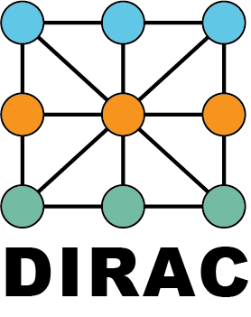

Welcome to DIRAC's documentation!
===================================

``scglue`` implements the GLUE (**G**\ raph **L**\ inked **U**\ nified **E**\ mbedding) model, for unpaired single-cell multi-omics data integration.

GLUE is a flexible framework that utilizes prior knowledge about feature relations to bridge the gap between different feature spaces during unpaired multi-modal data integration.

In the context of single-cell multi-omics, the data modalities correspond to omics layers, e.g., scRNA-seq, scATAC-seq, snmC-seq, etc. "Unpaired" means that different omics layers are not probed in the same single cells, but rather independent samples of (presumably) the same cell population. Prior knowledge consists of prior regulatory interactions between omics features, e.g., RNA genes and ATAC peaks in the case of scRNA-seq and scATAC-seq integration. These interactions are compiled into a guidance graph, and utilized by GLUE to help orient the multi-omics integration.

.. note::

   This project is under active development.

Contents
--------

.. toctree::

   usage
   api
